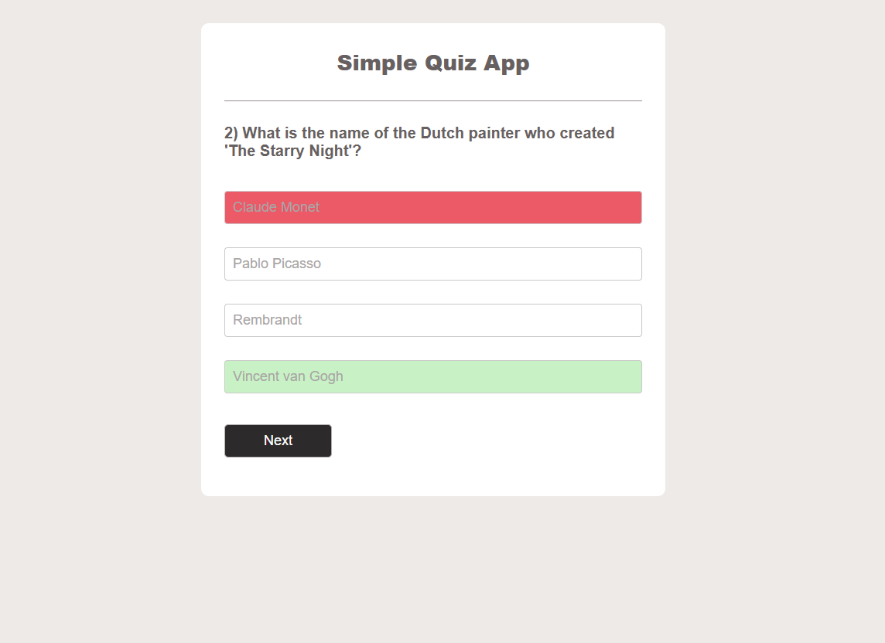

# 🧠 JavaScript Quiz App

A simple and interactive quiz application built using **JavaScript**, **HTML**, and **CSS**. This project tests users on general knowledge questions and provides instant feedback with score tracking.

## 🚀 Features

- ✅ Multiple-choice questions
- ✅ Score tracking
- ✅ Real-time feedback after each answer
- ✅ Progress through a set of quiz questions
- ✅ Responsive design for mobile and desktop

## 🛠️ Tech Stack

- **JavaScript (ES6+)** – App logic and interactivity
- **HTML5** – Structure and layout
- **CSS3** – Styling and responsive design

## 📸 Preview

 <!-- Replace with your actual screenshot path -->

## 📦 Getting Started

1. Clone the repository:

<pre>
   git clone https://github.com/shanikauwu1/js-quiz-app.git
</pre>

🎯 Learning Goals
This project helped reinforce:

JavaScript DOM manipulation

Event handling

Conditional logic and arrays

Creating reusable functions

Responsive layout using vanilla CSS

📜 License
This project is open-source and available under the MIT License.

[DEMO](https://shanikauwu1.github.io/js-quiz-app/)
